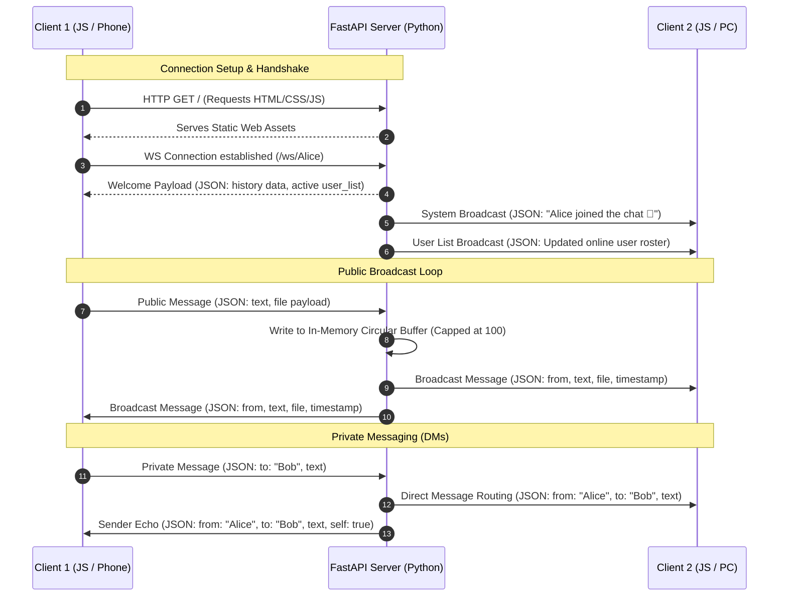

# 🌐 LoTalk — Local Network Real-Time Chat

> **A premium, zero-configuration, real-time chat application for local WiFi/LAN networks. No internet connection required.**

[](https://www.python.org/)
[](https://fastapi.tiangolo.com/)
[](https://www.uvicorn.org/)
[](#-architecture--data-flow)
[](#-client-side-engineering)
[](#-ui-ux--design-system)

LoTalk is designed for offline team environments, local workspaces, event venues, or file-sharing between PCs and mobile devices. It enables instant communication and file sharing directly on a local area network (LAN) without routing any data to the public internet.

---

## 🏗️ Architecture & Data Flow

LoTalk uses an **Event-Driven WebSocket Architecture** paired with standard **REST APIs** for file streaming and system metadata. The diagram below illustrates how client sessions, system messages, public chat, and private messaging (DMs) are routed:



---

## ✨ Engineering Features

### 1. Zero-Configuration Local Discovery
* **Host Terminal QR Generator:** On server startup, Python's `qrcode` package generates a terminal-friendly ASCII QR code representing the server's local network URL. Connecting a mobile device is as simple as scanning the host's CLI.
* **In-App Dynamic Invites:** Clicking "Share Room" fetches details from the `/api/server-info` API, rendering an SVG-based QR code on an overlay modal using a custom FastAPI response stream.

### 2. Multi-Media File Sharing Pipeline
* **Asynchronous Chunked Uploads:** Custom multipart file-upload REST endpoint (`/api/upload`) utilizing Python’s file stream utilities to store media with UUID names under static folders.
* **Context-Aware Rendering:** The JavaScript client reads mime-types on incoming packets to render attachments inline:
  * **Images:** Renders thumbnails that expand in a custom, touch-friendly Fullscreen Lightbox Modal on click.
  * **Videos/Audio:** Generates native audio/video DOM players with controls.
  * **Documents:** Formats clean, modern file-download cards featuring file sizes, filenames, and download icons.

### 3. State-Synchronized Private Messaging
* Users can toggle direct messages (DMs) by clicking on any online user in the sidebar.
* The WebSocket server validates the recipient state and securely routes the payload. If the recipient disconnects mid-transit, the server automatically responds with a system error notification to the sender.

### 4. Live Typing Indicators
* Debounced keydown-listeners on the client emit brief typing state notifications to the server.
* The server broadcasts active typists to all other clients, displaying a sleek, animated "typing..." dot overlay inside the main chat layout.

### 5. Dynamic Profile Avatars
* Users can upload custom images during registration or directly in the sidebar after joining.
* **Hash-based Theme Fallback:** If a profile photo isn't provided, an avatar is generated inline. The app takes a 32-bit hash of the user's name and applies a modulo operation to assign one of 8 premium, double-tone linear gradients (`av-0` to `av-7`).

---

## 🛠️ Codebase Design & Patterns

```
LoTalk/
├── start.py                # Automation script (dependency checks, CLI QR code, launcher)
├── backend/
│   ├── server.py           # FastAPI server (WebSockets, ConnectionManager, API routes)
│   └── requirements.txt    # Python backend dependencies
└── frontend/
    ├── templates/
    │   └── index.html      # Glassmorphic single-page web UI
    └── static/
        ├── css/
        │   └── style.css   # Responsive UI design system & CSS variables
        └── js/
            └── chat.js     # Single-State JS client (WebSocket listeners, UI bindings)
```

### Backend: The `ConnectionManager` Pattern
The backend uses a singleton-like `ConnectionManager` class to encapsulate all WebSocket transaction logical boundaries:
* **Active Mapping:** Keeps a Python dictionary mapping `username -> WebSocket` alongside a concurrent list of typing users and custom avatars.
* **Circular History Buffer:** Implements an in-memory buffer (`message_history`) constrained to a maximum size of 100 entries. New clients receive this array immediately upon connecting, preventing cold-starts.

### Client: The Single-State Pattern
To avoid standard DOM-query pollution and race conditions, the frontend `chat.js` uses a centralized `State` model:
```javascript
const State = {
  username: "",
  ws: null,
  connected: false,
  typingTimer: null,
  isTyping: false,
  pmTarget: null,       // null = public, "username" = private DM
  typingUsers: new Set(),
  avatarUrl: "",        // Profile URL from server
  avatarFile: null,     // Local avatar file object
  selectedFile: null,   // Local attachment file object
};
```
All UI changes, WebSocket payloads, and file uploads are dispatched based on mutations to this core schema.

---

## ⚡ Quick Start & Run Guide

### Requirements
* Python 3.8+ installed on your machine.
* A local WiFi or Ethernet network.

### Instant Start (Recommended)

#### On Windows:
Simply double-click [run.bat](file:///d:/Project/LoTalk/run.bat) or run it from your terminal:
```cmd
run.bat
```
This script automatically:
1. Verifies that Python is installed.
2. Checks for and creates a Python virtual environment (`.venv`) if one does not exist.
3. Automatically upgrades `pip` and installs/updates all required packages inside the virtual environment.
4. Boots up the server and prints a QR code in the terminal.

#### On macOS / Linux:
From the project root directory, run:
```bash
# Optional: Create and activate a virtual environment
python3 -m venv .venv
source .venv/bin/activate

# Start the application
python start.py
```
This script automatically:
1. Installs all required dependencies defined in [requirements.txt](file:///d:/Project/LoTalk/backend/requirements.txt).
2. Detects your computer's local IP address on the active network interface.
3. Prints a QR code inside the terminal for quick mobile connections.
4. Starts the ASGI server on port `8000`.

### Manual Start
If you prefer to run steps manually:
```bash
# 1. Create and activate a virtual environment
python -m venv .venv
# On Windows:
.venv\Scripts\activate
# On macOS/Linux:
source .venv/bin/activate

# 2. Install requirements
pip install -r backend/requirements.txt

# 3. Navigate to backend directory and start Uvicorn
cd backend
python -m uvicorn server:app --host 0.0.0.0 --port 8000
```

---

## 🔧 Troubleshooting & Network Firewall Rules

If other devices on your local network cannot connect to the server's IP address:

> [!WARNING]
> **Windows Firewall Restrictions**  
> Windows Defender Firewall frequently blocks incoming ports on public network profiles. You may need to create an inbound exception rule for Port 8000:
> ```
> Windows Defender Firewall -> Advanced Settings -> Inbound Rules -> New Rule -> Port -> TCP -> 8000 -> Allow the Connection
> ```

| Symptom | Probable Cause | Action |
|:---|:---|:---|
| **Other devices can't connect** | Firewall blocks Port 8000 or devices are on different subnets | Add Firewall Rule; double check that the mobile client is on the exact same WiFi network |
| **"Username Taken" during join** | The requested handle is already registered in the active server memory | Choose a unique username |
| **Connection closes instantly** | Username validation regex failed (invalid characters) | Use letters, numbers, hyphens, and underscores only |
| **Files fail to upload** | File size exceeds the configured upload buffer | Ensure attachments are under the 50MB file size limit (or 5MB for avatars) |

---

## 🚀 Performance & Production Checklist

If preparing this application to scale beyond local network environments, the following steps are recommended:

* [ ] **Database Persistence:** Introduce SQLAlchemy with PostgreSQL or SQLite to persist messages beyond server cycles.
* [ ] **Token-Based Authentication:** Implement OAuth2 with JWT tokens instead of plain connection query parameters.
* [ ] **Horizontal Scaling:** Integrate a Redis Pub/Sub backend with FastAPI to broadcast WebSocket messages across multiple nodes behind a load balancer.
* [ ] **P2P Video/Audio Sharing:** Leverage WebRTC signaling via the current WebSocket broker for direct peer-to-peer audio/video streaming.
* [ ] **Containerization:** Add a multi-stage Dockerfile packaging the Python backend and static frontend.
